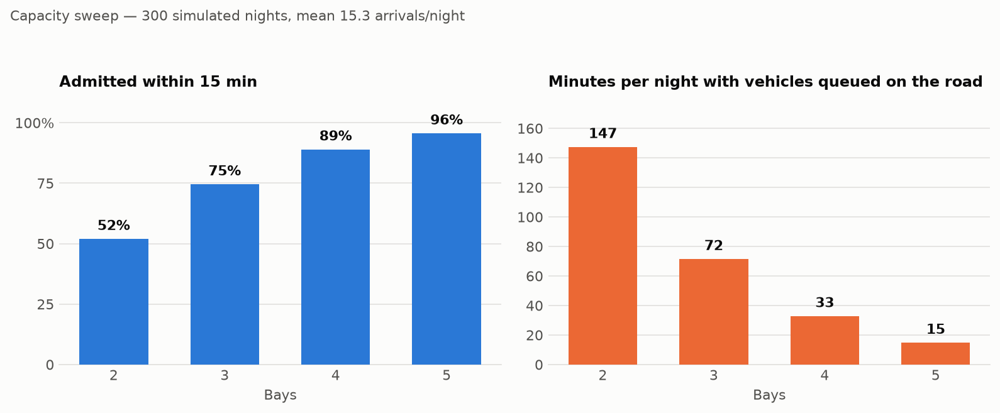
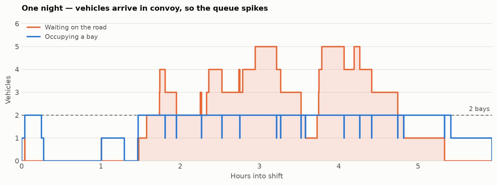

# YardWatch

Bay allocation, queue measurement and shift handover for a capacity-constrained
vehicle yard.

## The problem

A logistics site admits third-party HGVs through a single controlled barrier.
Inside the perimeter there are **two bays**. When both are occupied, arriving
vehicles have to wait **on the public road outside** until one frees up.

One operator manages this by eye, overnight, alongside patrols, CCTV and radio.
Two things follow from that:

1. **Nobody knows how bad the queue actually gets.** Vehicles idling on a public
   road are a traffic and safety problem, but there is no record of how often it
   happens or for how long — so there is no evidence base for asking whether two
   bays is the right number.
2. **Knowledge dies at handover.** Faults found during a shift (a lock panel not
   engaging, a barrier arm sticking, a camera dropping out) are written down in
   prose, and the incoming operator has to read it all to find the two things
   that still need action.

YardWatch addresses both: it enforces the capacity constraint, measures what the
queue costs, and generates a handover report ordered by what the next shift has
to act on.

## What it does

- **Allocates bays** first-come-first-served, and never exceeds capacity.
- **Measures the overflow** — how long vehicles waited outside, how long the
  queue got, and what proportion were admitted inside the target wait.
- **Logs shift events** — faults with severity, unauthorised access attempts,
  completed patrols.
- **Generates a handover report** that leads with unresolved faults and current
  yard state, rather than a chronological wall of text.

## Try it

```bash
python -m yardwatch.cli                    # simulated night shift, 2 bays
python -m yardwatch.cli --capacity 3       # what if there were three?
python -m yardwatch.cli --seed 7           # a different night
python -m yardwatch.cli --study 300        # capacity sweep across 300 nights
python -m yardwatch.cli --out handover.md  # write the report to a file
python -m yardwatch.charts                 # regenerate the README charts
pytest                                     # 25 tests
```

Runs are deterministic for a given seed, so any figure quoted below can be
reproduced by anyone with the same command.

## The finding

A single night proves nothing — arrivals are bursty, so one night can be quiet
and the next gridlocked by chance. The sweep runs every capacity against the
same 300 simulated nights:

```bash
python -m yardwatch.cli --study 300
```

<picture>
  <source media="(prefers-color-scheme: dark)" srcset="docs/capacity-dark.png">
  
</picture>

At a mean of 15.3 arrivals per night and a 15-minute target wait:

| Bays | Admitted within target | Road overflow / night | Peak queue (mean) | Worst queue | Worst wait | Nights with stranded vehicles |
|------|------------------------|-----------------------|-------------------|-------------|------------|-------------------------------|
| 2    | 52.0%                  | 147 min               | 4.9               | 20          | 215 min    | 17%                           |
| 3    | 74.6%                  | 72 min                | 3.4               | 15          | 166 min    | 4%                            |
| 4    | 89.0%                  | 33 min                | 2.5               | 11          | 94 min     | 2%                            |
| 5    | 95.6%                  | 15 min                | 1.8               | 10          | 68 min     | 0%                            |

Three things worth pulling out.

**Two bays coin-flips it.** Barely half of arrivals get in within target, and
on roughly one night in six at least one vehicle never gets in before the shift
ends. That is not a capacity that occasionally struggles; it is one that fails
routinely.

**Volume is not the problem — clustering is.** Fifteen vehicles across eight
hours is under 60% utilisation of two bays. On averages alone the yard looks
comfortable. The queues happen because vehicles arrive together, and averages
cannot see that. A single night makes the mechanism obvious — bay occupancy
pinned flat at two while the road queue spikes behind it:

<picture>
  <source media="(prefers-color-scheme: dark)" srcset="docs/one-night-dark.png">
  
</picture>

**There is no threshold, only a price.** Each added bay roughly halves the
overflow with no cliff to find, so the question is not "how many bays are
enough" but "how much road queueing is acceptable, and what is it worth". That
reframing is the actual output here: it replaces an argument about whether the
yard feels busy with a choice between numbers.

One caveat, stated plainly: the arrival rate, batch sizes and dwell
distribution in `simulate.py` are calibrated against observed volume, peak
window, typical turnaround and worst-observed queue — but they are a model, not
a measurement. Logging real arrival and departure timestamps would tighten it
considerably.

## Design decisions

**Why FIFO.** Admission is strictly by arrival time. A priority scheme (say,
shortest-expected-dwell first) would lower the mean wait, but a single operator
at a barrier cannot verify expected dwell, and any departure from visible
first-come-first-served invites disputes with drivers. Fairness that can be
enforced beats optimality that cannot.

**Why arrival and admission are separate events.** A vehicle joins the queue
even when a bay is free, and is admitted as a distinct step. This costs an extra
state transition but means wait time is *always* measured — including the near-zero
waits. Only recording waits when the yard is full would bias every statistic.

**Why an SLO rather than an average.** The headline indicator is the proportion
of vehicles admitted within a target wait, not the mean wait. A mean of 6
minutes hides the vehicle that waited 34. The proportion-within-target framing
comes from service reliability practice and answers the question that actually
matters: how often is this bad?

**Why replay rather than sampling.** Queue length over time is reconstructed by
replaying arrival and admission timestamps as +1/-1 changes, not by sampling at
intervals. Sampling would miss short spikes, which are precisely the events
worth catching.

**Why log-normal dwell times.** Most vehicles turn around quickly and a few
take far longer. Turnaround also cannot be negative, which rules out a normal
distribution. Sigma is tuned so roughly two thirds of dwells land in the
observed 20-45 minute band.

**Why batch arrivals rather than independent ones.** This is the correction
that mattered most. The first version modelled arrivals as an ordinary Poisson
process, each vehicle turning up independently. Calibrating against observed
reality broke that assumption immediately: about 15 vehicles per night with a
20-45 minute dwell is under 60% utilisation of two bays, and independent
arrivals at that rate produce a queue of two or three at worst. Queues of seven
or more do happen.

A queue that long at that volume is not possible unless vehicles arrive
*together* — which matches how the yard works, since hauliers run to shared
schedules and turn up in convoy. Arrivals are therefore modelled as a compound
Poisson process: arrival *events* occur at the hourly rate, and each event
brings a batch of one to five vehicles a few minutes apart.

The lesson generalises. The mean arrival rate was roughly right in the first
model and the conclusion was still wrong, because the failure is driven by the
correlation between arrivals rather than by their average. Fitting the average
is not the same as fitting the behaviour.

## A note on data

Everything in this repository is synthetic. It contains no real site data,
vehicle registration, carrier name or personnel name, and describes no specific
site's security arrangements. The domain model is deliberately generic: any
facility with a controlled barrier and limited bays has this problem.

## Structure

```
yardwatch/
  models.py     domain types — vehicles, events, shifts
  yard.py       bay allocation and queue management
  metrics.py    service-level indicators
  handover.py   shift handover report generation
  simulate.py   synthetic night-shift generator (batch arrivals)
  study.py      capacity sweeps across many nights
  charts.py     README figures, light and dark
  cli.py        command-line entry point
tests/          25 unit tests
docs/           generated charts
pyproject.toml  packaging and pytest configuration
```

## Next

- [ ] Log real arrival and departure timestamps to replace modelled parameters
- [ ] Export metrics to Prometheus and build a Grafana dashboard of bay
      occupancy, queue length and wait-time percentiles
- [ ] Persist to SQLite so shifts accumulate over weeks rather than one night
- [ ] Alert when queue length or wait time crosses threshold
- [ ] Deploy to AWS with Terraform
